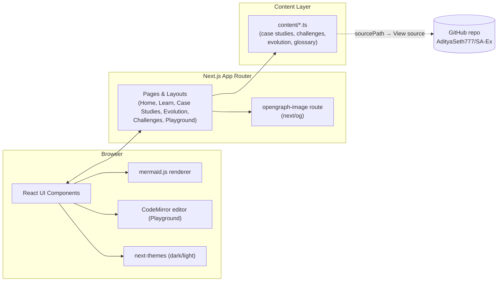
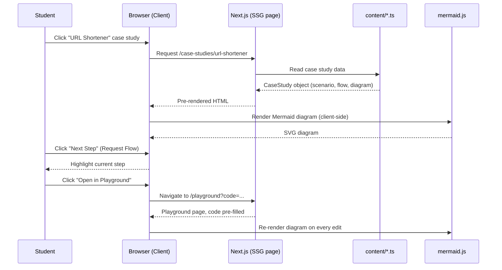
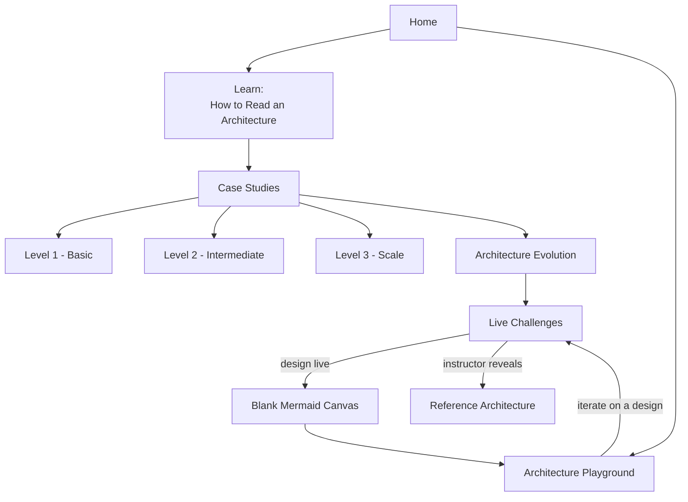

# Software Architecture Foundations

A study companion for first-year undergraduates learning software
architecture - not a submission platform or LMS. It helps students study
architecture diagrams before class, and gives instructors ready-to-open
live classroom design challenges.

**Learning progression:** Study → Understand → Trace → Modify → Design.

## What's here

- **Learn** (`/learn`) - the core building blocks (Client, Frontend,
  Backend, API, Database, Cache, Load Balancer, Message Queue, Object
  Storage, CDN, Authentication), each with a plain-language explanation
  and an interactive diagram.
- **Case Studies** (`/case-studies`) - 13 systems across three levels
  (Basic, Intermediate, Scale), each with a scenario, requirements, a
  Mermaid diagram, component explanations, a step-by-step request flow,
  "Think About It" discussion questions, and "What Happens If...?"
  failure/scaling scenarios.
- **Architecture Evolution** (`/evolution`) - three systems (Chat, Video
  Streaming, Food Delivery) shown at three points of scale, illustrating
  how requirements at scale force architectural change.
- **Live Challenges** (`/challenges`) - 8 classroom-ready design
  problems with a blank Mermaid canvas and a hidden reference
  architecture instructors can reveal after discussion.
- **Architecture Playground** (`/playground`) - a live Mermaid editor
  with a starter cheat sheet.

## Content structure

Educational content lives under `content/`, mirroring a study-repo layout:

```
content/
  01-basics/
  02-intermediate/
  03-scale/
  04-architecture-evolution/
  05-live-challenges/
  mermaid-examples.ts
  components-glossary.ts
```

Each case study/challenge/evolution file carries a `sourcePath` used to
generate its "View source on GitHub" link.

## Architecture

### System architecture

How the app itself is put together: static/SSG Next.js pages read
structured content at build time, the browser renders Mermaid diagrams
and the Playground editor client-side, and each piece of content links
back to its source file in this GitHub repo.



### Sequence diagram: studying a case study

A typical flow: a student opens a case study, traces the request flow
step by step, then jumps into the Playground with that diagram
pre-loaded to experiment with it.



### User flow diagram

How a student (or instructor) moves through the app, following the
Study → Understand → Trace → Modify → Design progression.



## Getting started

```bash
npm install
npm run dev
```

Open [http://localhost:3000](http://localhost:3000).

## Stack

Next.js (App Router) + TypeScript + Tailwind CSS, `mermaid` for diagram
rendering, `@uiw/react-codemirror` for the playground editor, and
`next-themes` for dark/light mode.
